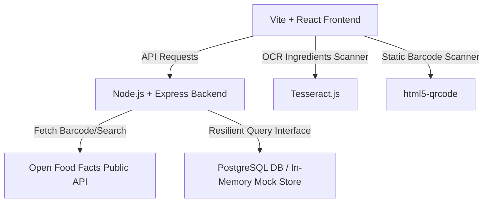

# 🛡️ NutriGuard - Personal Food Guard & Assistant

NutriGuard is a premium, real-time agentic food safety scanner and nutrition auditing dashboard. It helps users avoid dangerous allergens, match custom dietary baselines (Vegetarian, Vegan, Non-Veg), and achieve custom fitness goals (High Protein, Low Sugar, Low Sodium) by auditing ingredient lists instantly.

The project is built on a clean, minimal design system inspired by the natural organic food brand **Supernatural** (warm paper off-white background, bold off-black ink borders, flat offset shadows, and vibrant sunflower-yellow highlights).

---

## 🎨 Visual Preview & Aesthetics
*   **Warm Paper Canvas:** Uses a soft warm off-white background (`#f9f9f7`) covered with a custom minimal background doodle design representing healthy food, calories, and scanning vectors.
*   **Ink-Outlined Flat Cards:** Product details, history logs, and profile forms are styled as clean white card panels with **bold outlines (`3px solid #1e1e1e`)** and flat black drop shadows, recreating a hand-drawn cardboard feel.
*   **Playful Handwriting Font Mix:** Headings use playpen font styles (`Playpen Sans`, `Gochi Hand`) combined with a clear modern sans-serif typography (`Outfit`) for text details to ensure perfect legibility.

---

## 🔌 Public Database Integration
NutriGuard integrates directly with the **Open Food Facts API**, a free, open-source, crowdsourced public database of food products from around the world. 
*   **Live Data Feeds:** By connecting to the public database, the app accesses ingredient lists, brand tags, calorie breakdowns, and nutrient percentages for millions of barcodes.
*   **Robust Fallback Layer:** Since public APIs can occasionally rate-limit developer requests, NutriGuard implements a smart local mock fallback database mapping major products (Quaker Oats, Lay's, Nutella, Coca-Cola, Oreo) so that local testing always works instantly.

---

## ⚙️ Architecture & Tech Stack



### 1. Frontend (React + Vite)
*   **Webcam Barcode Scanning:** Integrates `html5-qrcode` to read barcodes directly from a camera feed or photo uploads.
*   **OCR Ingredient Auditing:** Integrates `Tesseract.js` on the client side to convert ingredient label photos into raw text blocks for backend matching.
*   **Interactive AI Chatbot widget:** Built-in floating robot (`🤖`) nutrition helper that functions offline (using local safety logs) or online using Google's **Gemini AI API** if a key is provided.

### 2. Backend (Node.js + Express)
*   **Allergen Matcher Engine:** Uses word boundaries and spelling variations to check ingredient text for allergen triggers.
*   **Goal Evaluator:** Audits nutrient values per 100g against FDA Daily Value (% DV) standards.
*   **Resilient DB Layer:** Automatically defaults to a pre-populated in-memory JavaScript cache if PostgreSQL is offline, ensuring the app works 100% out-of-the-box.

---

## 🔄 User Workflow

```mermaid
sequenceDiagram
    autonumber
    actor User
    participant App as React Frontend
    participant Server as Express Backend
    participant OFF as Open Food Facts API

    User->>App: Set Health Profile (Allergies, Goals, Diets)
    App->>Server: Update profile preferences in DB
    User->>App: Input Barcode or Upload Label Photo
    Note over App: If photo is ingredients label, Tesseract OCR converts it to text
    App->>Server: Request Product Analysis (barcode or OCR text)
    alt is Barcode
        Server->>OFF: Fetch product details from public database
        OFF-->>Server: Return ingredients and nutrients
    end
    Server->>Server: Audit ingredients against User Profile allergies & goals
    Server->>Server: Save analysis result to Scan History
    Server-->>App: Return Safety Report & Compatible Alternatives
    App-->>User: Display Safe/Warning/Danger report
```

---

## 🚀 Setup & Execution Guide

### Prerequisites
Make sure you have [Node.js](https://nodejs.org/) installed (v18+ recommended).

### 1. Run the Backend API
1.  Navigate into the `backend` folder:
    ```bash
    cd backend
    ```
2.  Install dependencies:
    ```bash
    npm install
    ```
3.  Start the Node server:
    ```bash
    node server.js
    ```
    *The server will initialize and listen on `http://localhost:4000`.*

### 2. Run the Frontend Dashboard
1.  Navigate into the `frontend` folder:
    ```bash
    cd ../frontend
    ```
2.  Install dependencies:
    ```bash
    npm install
    ```
3.  Start the Vite dev server:
    ```bash
    npm run dev
    ```
    *The frontend will boot up instantly on `http://localhost:5173/`.*

---

## 🧪 Testing Mock Barcodes
You can copy and paste these barcodes into the search bar to test safety outputs immediately (no PostgreSQL setup required):

*   **030000010206** (Quaker Oats) ➔ **SAFE** 🟢 (High Fiber, High Protein)
*   **028400199148** (Lay's Chips) ➔ **WARNING** 🟡 (High Sodium)
*   **049000028904** (Coca-Cola Classic) ➔ **DANGER** 🔴 (High Sugar, triggers Diabetic-Safe warnings)
